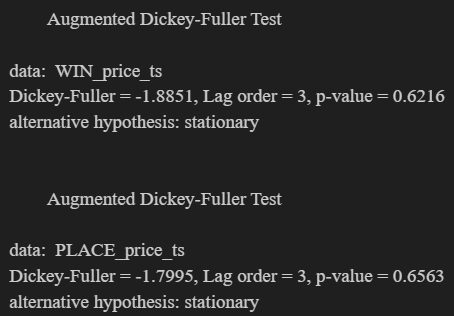
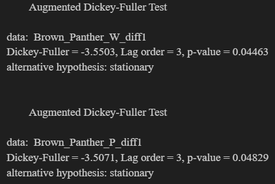
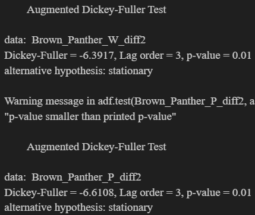

```{r setup, include=FALSE, echo=FALSE, eval=TRUE, message=FALSE, warning=FALSE, results='hide', tidy = TRUE}
knitr::opts_chunk$set(cache = TRUE, echo = FALSE, results = 'hide', warning = FALSE, message = FALSE, fig.show = 'hide')
```


# Introduction

Betting markets, and especially horse racing markets, are well suited for testing market efficiency, human rationality (including bias formation and classification), and time series-related algorithms(Lewis & Magee, 2011). The vast availability of live and historical data, such as prices (odds and the size of placed bets), provides a rich source for technical analysis. Additionally, other information, such as a horse’s recent form, genetics, and race conditions, can be used for fundamental analysis. Each bet has a specified termination point when its asset value is determined(Hausch & Ziemba, 2008).

This study focuses on the price data (specifically the odds and their implied probability) and its movement during the final minutes before a race starts. Actual trades were considered as the market price. To generate as many data points as possible, we chose the markets and times of the races with the highest liquidity.


# Literature Review

*Placeholder for literature review content.*

# Methods

*Placeholder for methods content.*

## Data Collection and Preprocessing

*Placeholder for data collection and preprocessing content.*

```{r chunk_1}

# Load necessary libraries
library(dplyr)
library(jsonlite)
library(lubridate)
library(ggplot2)
library(quantmod)
library(lifecycle)
library(tidyselect)
library(tidyverse)
library(zoo)
library(forecast)
library(tseries)

# Load necessary libraries for VAR model
library(tsibble)
library(feasts)
library(fabletools)

# Read the CSV file into a dataframe
WIN_PRO_df <- read.csv("csv_files/win_data_pro.csv")
PLACE_PRO_df <- read.csv("csv_files/place_data_PRO.csv")

# Filter only on the rows where actual trades have been made
WIN_PRO_df <- WIN_PRO_df %>% filter(trades != "[]")
PLACE_PRO_df <- PLACE_PRO_df %>% filter(trades != "[]")

# Convert timestamp to POSIXct
WIN_PRO_df <- WIN_PRO_df %>%
  mutate(timestamp = as.POSIXct(timestamp_unix / 1000, origin = "1970-01-01", tz = "GMT"))

PLACE_PRO_df <- PLACE_PRO_df %>%
  mutate(timestamp = as.POSIXct(timestamp_unix / 1000, origin = "1970-01-01", tz = "GMT"))

Bucket_size <- 9

# Create a equal frequency bin for time
WIN_PRO_df <- WIN_PRO_df %>%
  mutate(time_bucket = floor(as.numeric(timestamp) / Bucket_size))

PLACE_PRO_df <- PLACE_PRO_df %>%
  mutate(time_bucket = floor(as.numeric(timestamp) / Bucket_size))

# Create price column. Price is set to last traded price, which is fine because we filtered out the rows with no trades.
#Hence price is now actual trades, and size will be worked out later for each horse.
WIN_PRO_df <- WIN_PRO_df %>%
  mutate(
    price = last_traded_price
  )

PLACE_PRO_df <- PLACE_PRO_df %>%
  mutate(
    price = last_traded_price
  )

###Check horse IDS
# Read the horse name data into a dataframe
horse_names_df <- data.frame(
  horse_id = c(8421889, 7560122, 5465145, 3415981, 5105924, 7401388),
  horse_name = c("Romsdal", "Snow_Sky", "Havana_Beat", "Times_Up", "Brown Panther", "Island_Remede")
)

# Join the horse name data with the main dataframe
WIN_PRO_df <- WIN_PRO_df %>%
  left_join(horse_names_df, by = c("horse_id" = "horse_id"))

PLACE_PRO_df <- PLACE_PRO_df %>%
  left_join(horse_names_df, by = c("horse_id" = "horse_id"))

# Important instances to split df
PP_t <- "2015-05-15 16:06:18"
IP_t <- "2015-05-15 16:16:00"


# Split the data frame into three parts based on the given times
WIN_PRO_df_Morning <- WIN_PRO_df %>% filter(timestamp < PP_t)
WIN_PRO_df_PP <- WIN_PRO_df %>% filter(timestamp >= PP_t & timestamp < IP_t)
WIN_PRO_df_IP <- WIN_PRO_df %>% filter(timestamp >= IP_t)

PLACE_PRO_df_Morning <- PLACE_PRO_df %>% filter(timestamp < PP_t)
PLACE_PRO_df_PP <- PLACE_PRO_df %>% filter(timestamp >= PP_t & timestamp < IP_t)
PLACE_PRO_df_IP <- PLACE_PRO_df %>% filter(timestamp >= IP_t)
```

## Descriptive Analysis and Visualization

*Placeholder for descriptive analysis content.*

```{r chunk_2}
process_data <- function(data_df, market_type) {
  results_list <- list()
  
  for (horse in unique(data_df$horse_name)) {
    horse_df <- data_df %>% filter(horse_name == horse) %>%
      group_by(time_bucket) %>%
      summarise(mean_price = mean(price, na.rm = TRUE))
    
    # Save the horse-specific dataframe in a list
    results_list[[gsub(" ", "_", horse)]] <- list(
      data = horse_df,
      plot = ggplot(data = horse_df, aes(x = as.POSIXct(time_bucket * Bucket_size, origin = "1970-01-01", tz = "GMT"), y = mean_price)) +
        geom_line() +
        geom_point() +
        labs(
          title = paste(market_type, "market Price Over Time for", horse),
          x = "Time",
          y = "Mean Price"
        ) +
        theme_minimal() +
        theme(axis.text.x = element_text(angle = 45, hjust = 1),
              legend.position = "bottom") +
        scale_x_datetime(date_breaks = "1 min", date_labels = "%H:%M")
    )
    
    # Print the plot
    print(results_list[[gsub(" ", "_", horse)]][["plot"]])
  }
  
  return(results_list)
}

# Use the function for WIN and PLACE market data
win_results <- process_data(WIN_PRO_df_PP, "WIN")
place_results <- process_data(PLACE_PRO_df_PP, "PLACE")

Brown_Panther_PLACE_df <- place_results[["Brown_Panther"]][["data"]]
Brown_Panther_WIN_df <- win_results[["Brown_Panther"]][["data"]]

Brown_Panther_win_plot <- win_results[["Brown_Panther"]][["plot"]]
Brown_Panther_place_plot <- place_results[["Brown_Panther"]][["plot"]]


```

*Placeholder for time series analysis content.*

\begin{figure}[!htb]
\centering
\begin{minipage}{0.5\textwidth}
  \centering
  \includegraphics[width=0.95\linewidth]{figures/image12.png}
  \caption{Win Price Time Series for Brown Panther}
  \label{fig:winprice}
\end{minipage}%
\begin{minipage}{0.5\textwidth}
  \centering
  \includegraphics[width=0.95\linewidth]{figures/image13.png}
  \caption{Place Price Time Series for Brown Panther}
  \label{fig:placeprice}
\end{minipage}
\end{figure}

## Time Series Analysis

*Placeholder for time series analysis content.*

```{r chunk_3}
# Convert 'time_bucket' to POSIXct for proper time handling
Brown_Panther_WIN_df <- Brown_Panther_WIN_df %>%
  mutate(timestamp = as.POSIXct(time_bucket * Bucket_size, origin = "1970-01-01", tz = "GMT"))

# Check the range of the timestamp
start_time <- min(Brown_Panther_WIN_df$timestamp)
end_time <- max(Brown_Panther_WIN_df$timestamp)

# Create a sequence of time points from start to end with a step of 6 seconds
time_points <- seq(from = start_time, to = end_time, by = Bucket_size)

# Create a complete data frame with these time points
complete_data <- data.frame(timestamp = time_points)

# Merge with the original data to ensure alignment
complete_data <- complete_data %>%
  left_join(Brown_Panther_WIN_df, by = "timestamp")

# Fill missing prices with NA or any other method if necessary
complete_data <- complete_data %>%
  mutate(mean_price = ifelse(is.na(mean_price), NA, mean_price))

# Check the filled price data
summary(complete_data$mean_price)

# Extract the filled price data
filled_price_data <- complete_data$mean_price

# Create the time series object
# Use a lower frequency to match the length of the time series
# For example, assuming a reasonable periodicity within the data length
WIN_price_ts <- ts(filled_price_data, frequency = Bucket_size)

# Check the structure and length of the time series object
str(WIN_price_ts)
length(WIN_price_ts)

# Display the first few entries of the time series object
head(WIN_price_ts)

############################################################

# Convert 'time_bucket' to POSIXct for proper time handling
Brown_Panther_PLACE_df <- Brown_Panther_PLACE_df %>%
  mutate(timestamp = as.POSIXct(time_bucket * Bucket_size, origin = "1970-01-01", tz = "GMT"))

# Check the range of the timestamp
start_time <- min(Brown_Panther_PLACE_df$timestamp)
end_time <- max(Brown_Panther_PLACE_df$timestamp)

# Create a sequence of time points from start to end with a step of 6 seconds
time_points <- seq(from = start_time, to = end_time, by = Bucket_size)

# Create a complete data frame with these time points
complete_data <- data.frame(timestamp = time_points)

# Merge with the original data to ensure alignment
complete_data <- complete_data %>%
  left_join(Brown_Panther_PLACE_df, by = "timestamp")

# Fill missing prices with NA or any other method if necessary
complete_data <- complete_data %>%
  mutate(mean_price = ifelse(is.na(mean_price), NA, mean_price))

# Check the filled price data
summary(complete_data$mean_price)

# Extract the filled price data
filled_price_data <- complete_data$mean_price

# Create the time series object
# Use a lower frequency to match the length of the time series
# For example, assuming a reasonable periodicity within the data length
PLACE_price_ts <- ts(filled_price_data, frequency = Bucket_size)

# Check the structure and length of the time series object
str(PLACE_price_ts)
length(PLACE_price_ts)

# Display the first few entries of the time series object
head(PLACE_price_ts)

plot(WIN_price_ts, main="Win Price Time Series for Brown Panther", xlab="Time", ylab="Price", type="l")

plot(PLACE_price_ts, main="PLACE Price Time Series for Brown Panther", xlab="Time", ylab="Price", type="l")
```

### Stationarity

Its not stationary. Therefore we need to break it down and to understand the underlying components.

\begin{figure}[!htb]
\centering
\begin{minipage}{0.5\textwidth}
  \centering
  \includegraphics[width=0.95\linewidth]{figures/stl_win.png}
  \caption{STL Win Price Brown Panther}
  \label{fig:stlwin}
\end{minipage}%
\begin{minipage}{0.5\textwidth}
  \centering
  \includegraphics[width=0.95\linewidth]{figures/stl_place.png}
  \caption{STL Place Price Brown Panther}
  \label{fig:stlplace}
\end{minipage}
\end{figure}

```{r chunk_6}
adf_test_result <- adf.test(WIN_price_ts, alternative = "stationary")
print(adf_test_result)

adf_test_result_2 <- adf.test(PLACE_price_ts, alternative = "stationary")
print(adf_test_result_2)
```


```{r chunk_7}
# Step 5: Decomposition of Time Series (if seasonal patterns expected)
decomposed <- stl(WIN_price_ts, s.window = "periodic")
plot(decomposed)

decomposed_2 <- stl(PLACE_price_ts, s.window = "periodic")
plot(decomposed_2)
```

```{r chunk_8}
# Step 6: Differencing 
Brown_Panther_W_diff1 <- diff(Brown_Panther_WIN_df$mean_price, lag = 1)

Brown_Panther_P_diff1 <- diff(Brown_Panther_PLACE_df$mean_price, lag = 1)

# Step 7: ADF Test to check stationarity after differencing
adf_result_diff <- adf.test(Brown_Panther_W_diff1, alternative = "stationary")
print(adf_result_diff)

adf_result_diff_P <- adf.test(Brown_Panther_P_diff1, alternative = "stationary")
print(adf_result_diff_P)
```

P-Value > 0.05, hence we take do another differential

```{r chunk_9}
# Step 8: Second Differencing
Brown_Panther_W_diff2 <- diff(Brown_Panther_W_diff1, lag = 1)

Brown_Panther_P_diff2 <- diff(Brown_Panther_P_diff1, lag = 1)

# Step 9: ADF Test to check stationarity after second differencing
adf.test(Brown_Panther_W_diff2, alternative = "stationary")

adf.test(Brown_Panther_P_diff2, alternative = "stationary")
```


### VAR-Modell and Granger Causality

*Placeholder for VAR model and Granger causality content.*

```{r chunk_10}
# Step 10: Estimation of VAR Model
library(vars)
library(tseries)
library(quantmod)

# Check the size of both the time series

length(Brown_Panther_W_diff2)
length(Brown_Panther_P_diff2)
```

```{r chunk_11}
# Estimating vector autoregression and testing for causality

VAR_est <- VAR(cbind(Brown_Panther_W_diff2,Brown_Panther_P_diff2), ic="AIC", lag.max = 3)
coeftest(VAR_est)
causality(VAR_est, cause="Brown_Panther_W_diff2")["Granger"]
causality(VAR_est, cause="Brown_Panther_P_diff2")["Granger"]

summary(VAR_est)

# Interpretation: The Granger-causality test states that at the 95% confidence interval, oil returns do significantly Granger-cause the inflation rate but not vice versa.
```


# Results

*Placeholder for results content.*

## VAR Model Estimation Results

### Model Specifications:
Vector Autoregression (VAR) modeled the interdependencies between changes in winning and placing odds for Brown Panther. Analyzed variables were differences of winning odds (\(W_{diff2}\)) and placing odds (\(P_{diff2}\)), with a constant included.

### Estimated Equations:
Winning Odds: W_diff2 = -0.662(W_diff2.l1) - 0.540(W_diff2.l2) - 0.346(W_diff2.l3) + 0.198(P_diff2.l1) + 0.022(P_diff2.l2) - 0.175(P_diff2.l3) + 0.00054(const)
Placing Odds: P_diff2 = 0.077(W_diff2.l1) + 0.037(W_diff2.l2) - 0.004(W_diff2.l3) - 0.669(P_diff2.l1) - 0.564(P_diff2.l2) - 0.251(P_diff2.l3) + 0.00038(const)

### Statistical Insights:
Significant predictors included \(W_{diff2.l1}\), \(W_{diff2.l2}\), \(P_{diff2.l1}\) for winning odds, and \(P_{diff2.l1}\), \(P_{diff2.l2}\) for placing odds, indicating a strong past influence on present odds.

### Model Performance:
Multiple R-squared values were 35.41% for winning odds and 31.36% for placing odds. Both models' F-statistics confirmed statistical significance, validating the model's predictive reliability.

### Interpretation:
Significant negative coefficients suggest a mean-reverting dynamic in odds behavior, influenced by historical data. The positive correlation (0.6115) between the models' residuals underscores interconnected market movements.


# References

# Figures









# Appendix

1. Packages used in this report: 

```{r chunk_12}
# install.packages('dplyr')
# install.packages('jsonlite')
# install.packages('lubridate')
# install.packages('ggplot2')
# install.packages('quantmod')
# install.packages('lifecycle')
# install.packages('tidyselect')
# install.packages("tidyverse")
# install.packages("zoo")

# Install necessary packages for VAR model
# install.packages("tsibble")
# install.packages("feasts")
# install.packages("fabletools")

```

