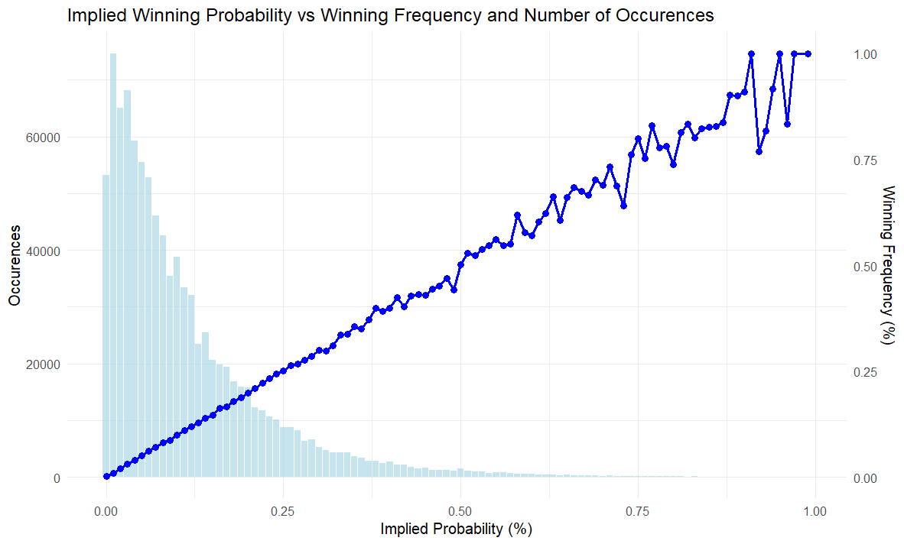
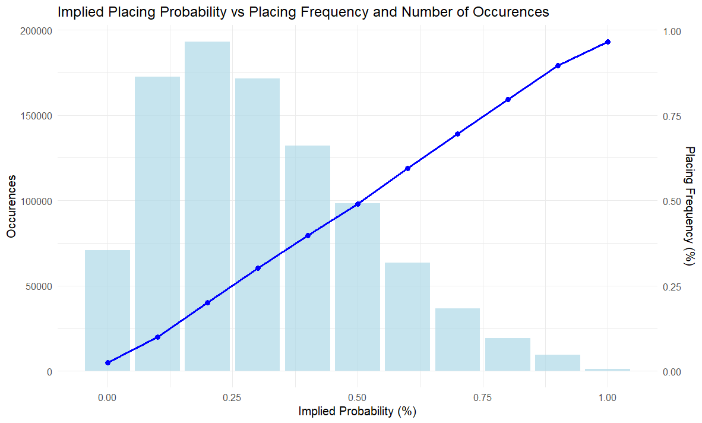
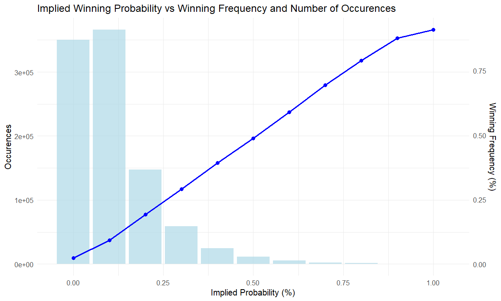
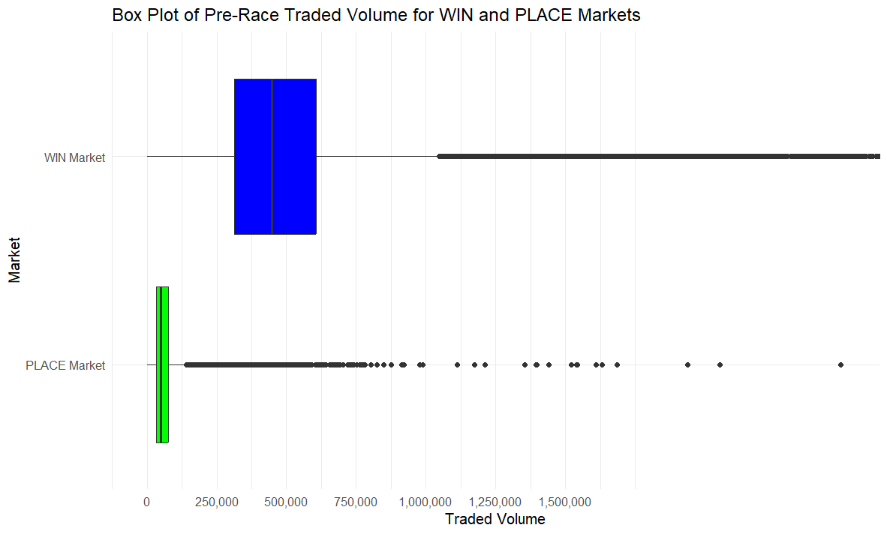
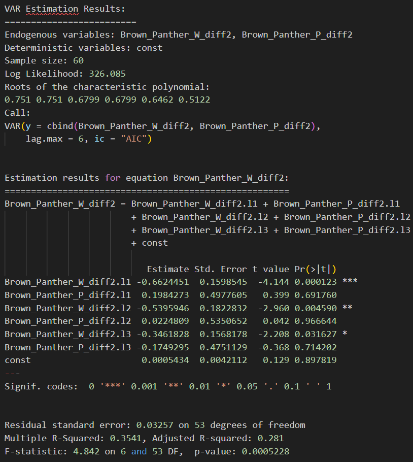
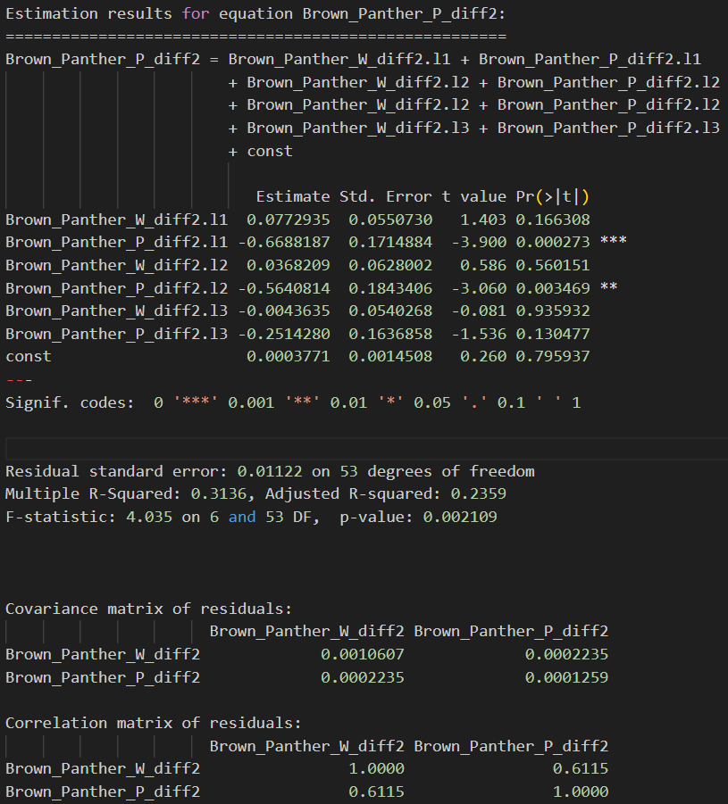

```{r setup, include=FALSE, echo=FALSE, eval=TRUE, message=FALSE, warning=FALSE, results='hide', tidy = TRUE}
knitr::opts_chunk$set(cache = TRUE, echo = FALSE, results = 'hide', warning = FALSE, message = FALSE, fig.show = 'hide')

```

\newpage

# Introduction

Betting markets on betting exchanges are well suited for testing market efficiency, human rationality (including bias formation and classification), and time series-related algorithms(Lewis & Magee, 2011). Horse racing markets are especially useful for such analyses, as they are in abundance, liquid and fast to get results. The vast availability of live and historical data, such as prices (odds and the size of traded bets), provides a rich source for technical analysis. Additionally, other information, such as a horse’s recent form, genetics, and race conditions, can be used for fundamental analysis. Each bet has a specified termination point when its asset value is determined
(Hausch & Ziemba, 2008).  

This study analyses the price data, specifically the odds and their implied probability on win and place markets for horse races.These prices are compared between the two markets to investigate the temporal relationship. It focusses on the price movement during the final minutes before a race starts. Actual trades at the time they occured were considered as the market price. To generate as many data points as possible, we chose the markets and times of the races with the highest liquidity. Data from Betfair, the world’s biggest betting exchange, is used, where the markets are much more efficient than at traditional bookmakers (Franck et al., 2013).


# Literature Review

Models that utilize win market probabilities to predict place-market probabilities in horse racing have been developed and refined over the years. Two of the most notable models are Harville’s model, introduced in 1973, and Henery’s model, proposed in 1981. The Harville model is the simplest  model, and have been successfully implemented in the past (Hausch & Ziemba, 2008). It does however have a systemic bias of overestimating the placing probabilities of the favourite horses.  

Time study analyses on Horse racing markets have been conducted and published. During this literature review, no publications were found that focusses on the causal relationships between different markets e.g. the win and place markets. (Tondapu, 2024) concluded that autocorrelation exists in horse racing markets, but decays quickly, indicating high information efficiency. He also found that volatility clustering are present indicating weaker efficiency.
 

# Methods

The observation that place markets are less liquid than win markets in horse racing has led to the hypothesis that win markets are more efficient, have a causal relationship with place markets, and can therefore be used for price discovery and market creation. The reasoning behind this hypothesis is based on the following suspicions:  

1) There are bigger spreads present in the place markets and desperate punters will trade at these spreads. 
2) Information is assumed to reflect faster in liquid markets as more participants are trading.  

The below graph was created by comparing the implied probability of Betfair's starting price right before the races started to the actual outcomes of races for all races from 1 January 2013 to 1 May 2024.




The authors were so confident in this hypothesis that they developed a model in R, which connects to Betfair’s API to stream live win market odds. They applied the Harville method to place bets in the place markets. The betting amounts were determined using the Kelly criterion, which balances risk and reward to optimize wealth.  

This was an example of a model being applied in the “danger zone” of Drew Conway’s data science Venn diagram (Conway, Drew, 2010). A contributing factor for "putting the cart before the horses" and implement a model before proper analyses, is that to live stream data through the Betfair API, one should place bets to have access. It cannot be used only to retrieve data, required for the analysis.

The approach was changed, and the authors decided to perform time series analysis on a historic race that took place in York on 15 May 2015. The price data of all six participating horses were analysed, however only the detailed analysis of one specific horse, Brown Panther, is described in this report:


## Data Collection and Preprocessing

The data source for this study was Betfair’s historical data, which is available through three pricing plans: Basic (free, 1-minute time frequency), Advanced (£69/month, 1-second time frequency), and Pro (£230/month, 50-millisecond time frequency). Pro plan data for May 2015 is available for free and was chosen for this study.  

The selected race, held on May 15, 2015, met the criteria of having only six runners, high liquidity (£2.43 million traded on the win market and £0.2 million on the place market), and no hurdles.  

Each market is stored in a JSON file. The files for the selected race were retrieved and converted CSV files for analysis. The relevant fields included the UNIX timestamp, market identification, horse identification, last traded price, traded volume, an "in play" indicator, and a tuple containing the traded price and cumulative volume traded at that price. The study focused on analysing the actual trades over time, using fields like last traded price and volume only to verify and validate the data


```{r chunk_1}

# Load necessary libraries
library(dplyr)
library(jsonlite)
library(lubridate)
library(ggplot2)
library(quantmod)
library(lifecycle)
library(tidyselect)
library(tidyverse)
library(zoo)
library(forecast)
library(tseries)

# Load necessary libraries for VAR model
library(tsibble)
library(feasts)
library(fabletools)

# Read the CSV file into a dataframe
WIN_PRO_df <- read.csv("csv_files/win_data_pro.csv")
PLACE_PRO_df <- read.csv("csv_files/place_data_PRO.csv")

# Filter only on the rows where actual trades have been made
WIN_PRO_df <- WIN_PRO_df %>% filter(trades != "[]")
PLACE_PRO_df <- PLACE_PRO_df %>% filter(trades != "[]")

# Convert timestamp to POSIXct
WIN_PRO_df <- WIN_PRO_df %>%
  mutate(timestamp = as.POSIXct(timestamp_unix / 1000, origin = "1970-01-01", tz = "GMT"))

PLACE_PRO_df <- PLACE_PRO_df %>%
  mutate(timestamp = as.POSIXct(timestamp_unix / 1000, origin = "1970-01-01", tz = "GMT"))

Bucket_size <- 9

# Create a equal frequency bin for time
WIN_PRO_df <- WIN_PRO_df %>%
  mutate(time_bucket = floor(as.numeric(timestamp) / Bucket_size))

PLACE_PRO_df <- PLACE_PRO_df %>%
  mutate(time_bucket = floor(as.numeric(timestamp) / Bucket_size))

# Create price column. Price is set to last traded price, which is fine because we filtered out the rows with no trades.
#Hence price is now actual trades, and size will be worked out later for each horse.
WIN_PRO_df <- WIN_PRO_df %>%
  mutate(
    price = last_traded_price
  )

PLACE_PRO_df <- PLACE_PRO_df %>%
  mutate(
    price = last_traded_price
  )

###Check horse IDS
# Read the horse name data into a dataframe
horse_names_df <- data.frame(
  horse_id = c(8421889, 7560122, 5465145, 3415981, 5105924, 7401388),
  horse_name = c("Romsdal", "Snow_Sky", "Havana_Beat", "Times_Up", "Brown Panther", "Island_Remede")
)

# Join the horse name data with the main dataframe
WIN_PRO_df <- WIN_PRO_df %>%
  left_join(horse_names_df, by = c("horse_id" = "horse_id"))

PLACE_PRO_df <- PLACE_PRO_df %>%
  left_join(horse_names_df, by = c("horse_id" = "horse_id"))

# Important instances to split df
PP_t <- "2015-05-15 16:06:18"
IP_t <- "2015-05-15 16:16:00"

# Split the data frame into three parts based on the given times
WIN_PRO_df_Morning <- WIN_PRO_df %>% filter(timestamp < PP_t)
WIN_PRO_df_PP <- WIN_PRO_df %>% filter(timestamp >= PP_t & timestamp < IP_t)
WIN_PRO_df_IP <- WIN_PRO_df %>% filter(timestamp >= IP_t)

PLACE_PRO_df_Morning <- PLACE_PRO_df %>% filter(timestamp < PP_t)
PLACE_PRO_df_PP <- PLACE_PRO_df %>% filter(timestamp >= PP_t & timestamp < IP_t)
PLACE_PRO_df_IP <- PLACE_PRO_df %>% filter(timestamp >= IP_t)
```

## Descriptive Analysis and Visualization

Data was segmented by horse and market type (win, PLACE) to compute time-bucketed mean prices. Each horse's data was summarized over defined time buckets, and visualized to display price trends over time.

The data hygiene and distributions were thoroughly explored and investigated for the two markets for each of the six horses. It was determined that the most critical processing step at this stage was to obtain as many equally spaced intervals as possible, with each interval containing at least one data point, particularly for the less liquid place markets. Key decisions needed to be made regarding the triggers influencing this process, specifically the chosen horse, the selected time period used, and the bin size:  

The chosen horse was Brown Panther, the horse with the most trades (£1.19 mil in total). The bin size and time period were more difficult to determine, as the closer the time gets to the start of the race, the more liquid the markets become, hence shorter or narrower bins could be used which implies more bins per time period, however shorter time periods. A trial and error approach was used to decide on 65 bins with a width of 9 seconds, hence a time period from 9.75 minutes before race start until race start.


```{r chunk_2}
process_data <- function(data_df, market_type) {
  results_list <- list()
  
  for (horse in unique(data_df$horse_name)) {

    horse_df <- data_df %>% filter(horse_name == horse) %>%
      group_by(time_bucket) %>%
      summarise(mean_price = mean(price, na.rm = TRUE))
    
    # Save the horse-specific dataframe in a list
    results_list[[gsub(" ", "_", horse)]] <- list(
      data = horse_df, 
      plot = ggplot(data = horse_df, aes(x = as.POSIXct(time_bucket * Bucket_size, origin = "1970-01-01", tz = "GMT"), y = mean_price)) +
        geom_line() +
        geom_point() +
        labs(
          title = paste(market_type, "market Price Over Time for", horse), 
          x = "Time", 
          y = "Mean Price"
        ) +
        theme_minimal() +
        theme(axis.text.x = element_text(angle = 45, hjust = 1), 
              legend.position = "bottom") +
        scale_x_datetime(date_breaks = "1 min", date_labels = "%H:%M")
    )
    
    # Print the plot
    print(results_list[[gsub(" ", "_", horse)]][["plot"]])

  }
  
  return(results_list)
}

# Use the function for WIN and PLACE market data

win_results <- process_data(WIN_PRO_df_PP, "WIN")
place_results <- process_data(PLACE_PRO_df_PP, "PLACE")

Brown_Panther_PLACE_df <- place_results[["Brown_Panther"]][["data"]]
Brown_Panther_WIN_df <- win_results[["Brown_Panther"]][["data"]]

Brown_Panther_win_plot <- win_results[["Brown_Panther"]][["plot"]]
Brown_Panther_place_plot <- place_results[["Brown_Panther"]][["plot"]]

```

\begin{figure}[!htb]
\centering
\begin{minipage}{0.5\textwidth}
  \centering
  \includegraphics[width=0.95\linewidth]{figures/image12.png}
  \caption{Win Price Time Series for Brown Panther}
  \label{fig:winprice}
\end{minipage}%
\begin{minipage}{0.5\textwidth}
  \centering
  \includegraphics[width=0.95\linewidth]{figures/image13.png}
  \caption{Place Price Time Series for Brown Panther}
  \label{fig:placeprice}
\end{minipage}
\end{figure}

## Time Series Analysis and Stationarity

Data timestamps were standardized using `POSIXct`, structured to ensure no time gaps for continuous analysis. Time series for WIN and PLACE markets were created with uniform frequency settings, filled with NA for missing values.

```{r chunk_3}
# Convert 'time_bucket' to POSIXct for proper time handling
Brown_Panther_WIN_df <- Brown_Panther_WIN_df %>%
  mutate(timestamp = as.POSIXct(time_bucket * Bucket_size, origin = "1970-01-01", tz = "GMT"))

# Check the range of the timestamp
start_time <- min(Brown_Panther_WIN_df$timestamp)
end_time <- max(Brown_Panther_WIN_df$timestamp)

# Create a sequence of time points from start to end with a step of 6 seconds
time_points <- seq(from = start_time, to = end_time, by = Bucket_size)

# Create a complete data frame with these time points
complete_data <- data.frame(timestamp = time_points)

# Merge with the original data to ensure alignment
complete_data <- complete_data %>%
  left_join(Brown_Panther_WIN_df, by = "timestamp")

# Fill missing prices with NA or any other method if necessary
complete_data <- complete_data %>%
  mutate(mean_price = ifelse(is.na(mean_price), NA, mean_price))

# Check the filled price data
summary(complete_data$mean_price)

# Extract the filled price data
filled_price_data <- complete_data$mean_price

# Create the time series object
# Use a lower frequency to match the length of the time series
# For example, assuming a reasonable periodicity within the data length
WIN_price_ts <- ts(filled_price_data, frequency = Bucket_size)

# Check the structure and length of the time series object
str(WIN_price_ts)
length(WIN_price_ts)

# Display the first few entries of the time series object
head(WIN_price_ts)

############################################################

# Convert 'time_bucket' to POSIXct for proper time handling
Brown_Panther_PLACE_df <- Brown_Panther_PLACE_df %>%
  mutate(timestamp = as.POSIXct(time_bucket * Bucket_size, origin = "1970-01-01", tz = "GMT"))

# Check the range of the timestamp
start_time <- min(Brown_Panther_PLACE_df$timestamp)
end_time <- max(Brown_Panther_PLACE_df$timestamp)

# Create a sequence of time points from start to end with a step of 6 seconds
time_points <- seq(from = start_time, to = end_time, by = Bucket_size)

# Create a complete data frame with these time points
complete_data <- data.frame(timestamp = time_points)

# Merge with the original data to ensure alignment
complete_data <- complete_data %>%
  left_join(Brown_Panther_PLACE_df, by = "timestamp")

# Fill missing prices with NA or any other method if necessary
complete_data <- complete_data %>%
  mutate(mean_price = ifelse(is.na(mean_price), NA, mean_price))

# Check the filled price data
summary(complete_data$mean_price)

# Extract the filled price data
filled_price_data <- complete_data$mean_price

# Create the time series object
# Use a lower frequency to match the length of the time series
# For example, assuming a reasonable periodicity within the data length
PLACE_price_ts <- ts(filled_price_data, frequency = Bucket_size)

# Check the structure and length of the time series object
str(PLACE_price_ts)
length(PLACE_price_ts)

# Display the first few entries of the time series object
head(PLACE_price_ts)

plot(WIN_price_ts, main="Win Price Time Series", xlab="Time", ylab="Price", type="l")

plot(PLACE_price_ts, main="PLACE Price Time Series", xlab="Time", ylab="Price", type="l")
```

The stationarity of win and place price time series for Brown Panther was evaluated using the Augmented Dickey-Fuller (ADF) test, confirming non-stationarity cannot be rejected as initial tests indicated p-values greater than 0.05. Subsequent decomposition using STL revealed seasonal components, depicted in plots for both markets. To achieve stationarity, first and second differencing were applied, followed by repeated ADF tests to assess each step's effectiveness in stabilizing the series.  

\begin{figure}[!htb]
\centering
\begin{minipage}{0.5\textwidth}
  \centering
  \includegraphics[width=0.95\linewidth]{figures/stl_win.png}
  \caption{STL Win Price Brown Panther}
  \label{fig:stlwin}
\end{minipage}%
\begin{minipage}{0.5\textwidth}
  \centering
  \includegraphics[width=0.95\linewidth]{figures/stl_place.png}
  \caption{STL Place Price Brown Panther}
  \label{fig:stlplace}
\end{minipage}
\end{figure}

```{r chunk_6}
adf_test_result <- adf.test(WIN_price_ts, alternative = "stationary")
print(adf_test_result)

adf_test_result_2 <- adf.test(PLACE_price_ts, alternative = "stationary")
print(adf_test_result_2)

```

```{r chunk_7}
# Step 5: Decomposition of Time Series (if seasonal patterns expected)
decomposed <- stl(WIN_price_ts, s.window = "periodic")
plot(decomposed)

decomposed_2 <- stl(PLACE_price_ts, s.window = "periodic")
plot(decomposed_2)
```

```{r chunk_8}

# Step 6: Differencing 

Brown_Panther_W_diff1 <- diff(Brown_Panther_WIN_df$mean_price, lag = 1)

Brown_Panther_P_diff1 <- diff(Brown_Panther_PLACE_df$mean_price, lag = 1)

# Step 7: ADF Test to check stationarity after differencing

adf_result_diff <- adf.test(Brown_Panther_W_diff1, alternative = "stationary")
print(adf_result_diff)

adf_result_diff_P <- adf.test(Brown_Panther_P_diff1, alternative = "stationary")
print(adf_result_diff_P)

```

```{r chunk_9}
# Step 8: Second Differencing
Brown_Panther_W_diff2 <- diff(Brown_Panther_W_diff1, lag = 1)

Brown_Panther_P_diff2 <- diff(Brown_Panther_P_diff1, lag = 1)

# Step 9: ADF Test to check stationarity after second differencing
adf.test(Brown_Panther_W_diff2, alternative = "stationary")

adf.test(Brown_Panther_P_diff2, alternative = "stationary")
```

# VAR-Model and Granger Causality

The Vector Autoregression (VAR) Model and Granger causality tests were conducted to explore relationships between the second differenced win and place price time series of Brown Panther.  The VAR model was estimated considering up to three lags based on the Akaike Information Criterion (AIC). Granger causality tests were applied to determine the directional influences between the series.

```{r chunk_10}

# Step 10: Estimation of VAR Model

library(vars)
library(tseries)
library(quantmod)

# Check the size of both the time series

length(Brown_Panther_W_diff2)
length(Brown_Panther_P_diff2)

```

```{r chunk_11}
# Estimating vector autoregression and testing for causality

VAR_est <- VAR(cbind(Brown_Panther_W_diff2,Brown_Panther_P_diff2), ic="AIC", lag.max = 3)
coeftest(VAR_est)
causality(VAR_est, cause="Brown_Panther_W_diff2")["Granger"]
causality(VAR_est, cause="Brown_Panther_P_diff2")["Granger"]

summary(VAR_est)

```

## VAR Model Estimation Results

A VAR model was applied to Brown Panther's differenced win and place price data across 60 observations, considering up to 6 lags as suggested by the Akaike Information Criterion (AIC). The analysis revealed significant lagged interactions within and between the two markets, offering predictive insights into price movements.

### Key Findings:
- **WIN Prices Dynamics:**
  - Significant negative coefficients at lags 1 and 2 demonstrate a mean-reverting behavior in WIN prices.
  - PLACE prices showed limited influence on WIN prices, indicating minimal cross-market effects.

- **PLACE Prices Dynamics:**
  - Strong self-reversion in PLACE prices evident from significant negative coefficients at lags 1 and 2.
  - Minimal influence from WIN prices, emphasizing market-specific dynamics.

### Model Diagnostics and Statistical Significance:
- **Model Stability:** Confirmed by roots of the characteristic polynomial all lying within the unit circle.
- **Residuals Analysis:** Low covariance and a moderate correlation of 0.6115 between residuals suggest a good model fit but highlight some unexplained interactions.
- **Adjusted R-squared:** Values of 0.281 for WIN and 0.2359 for PLACE indicate moderate explanatory power.
- **F-statistics:** Statistically significant across both equations, validating the model's predictive reliability.

### Interpretation

The VAR analysis underscores the mean-reverting nature of both win and PLACE markets, with past price changes serving as strong predictors for future prices. The observed dynamics are predominantly market-specific with limited inter-market dependencies. This understanding enhances strategic betting decisions, leveraging historical data to predict future odds movements effectively. The significant lags are however of short duration.


# Conclusion

The hypothesis that win markets are more efficient, have a causal relationship with place markets, and can therefore be used for price discovery and market creation is rejected based on this analysis. The win price and place price for Brown Panther has a correlation of 0.95 however as mentioned very little causality. This is yet another example that demonstrates that correlation does not imply causation.

The limitations of this study is that the time series analysis was only conducted on one horse race due to time constraints. Future investigations will be conducted on the causal relationship between the win market and the available trades in the place market, not only on actual trades.


\newpage

# Bibliography

Casadesus-Masanell, R., & Campbell, N. (2019). Platform competition: Betfair and the UK market for sports betting. Journal of Economics & Management Strategy, 28(1), 29–40. https://doi.org/10.1111/jems.12310  

Conway, Drew. (2010, September 30). The Data Science Venn Diagram. Drew Conway. http://drewconway.com/zia/2013/3/26/the-data-science-venn-diagram  

Franck, E., Verbeek, E., & Nüesch, S. (2013). Inter‐market Arbitrage in Betting. Economica, 80(318), 300–325. https://doi.org/10.1111/ecca.12009  

Hausch, D. B., & Ziemba, W. T. (2008). Handbook of sports and lottery markets (1st edition). Elsevier/North-Holland.  

Lewis, B., & Magee, C. (2011). The betfair package: An R implementation of the Betfair API.  

Lo, V. S. Y., & Bacon-Shone, J. (1994). A Comparison Between Two Models for Predicting Ordering Probabilities in Multiple-Entry Competitions.   Journal of the Royal Statistical Society. Series D (The Statistician), 43(2), 317–327. https://doi.org/10.2307/2348347  

Sung, M.-C., & Johnson, J. E. V. (2008). Semi-Strong Form Information Efficiency in Horse Race Betting Markets. In Handbook of Sports and Lottery Markets (pp. 275–306). https://doi.org/10.1016/B978-044450744-0.50017-2  

Thaler, R. H., & Ziemba, W. T. (1988). Anomalies: Parimutuel Betting Markets: Racetracks and Lotteries. The Journal of Economic Perspectives, 2(2), 161–174.  

Tondapu, N. (2024). Efficient Market Dynamics: Unraveling Informational Efficiency in UK Horse Racing Betting Markets Through Betfair’s Time Series Analysis.


\newpage

# Appendix A: Output of hypothesis formation







\newpage

# Appendix B: Win and place markets for all the horses

\begin{figure}[!htb]
\centering

\begin{minipage}{0.5\textwidth}
  \centering
  \includegraphics[width=0.95\linewidth]{\detokenize{figures/image 0.png}}
  \caption{Win market Brown Panther}
  \label{fig:Win market Brown Panther}
\end{minipage}%

\begin{minipage}{0.5\textwidth}
  \centering
  \includegraphics[width=0.95\linewidth]{\detokenize{figures/image copy 7.png}}
  \caption{Place market Brown Panther}
  \label{fig:Place market Brown Panther}
\end{minipage}

\end{figure}

\begin{figure}[!htb]
\centering

\begin{minipage}{0.5\textwidth}
  \centering
  \includegraphics[width=0.95\linewidth]{\detokenize{figures/image copy 1.png}}
  \caption{Win market Romsdal}
  \label{fig:Win market Romsdal}
\end{minipage}%
\hspace{0.05\textwidth} % Adjust the space between the minipages if needed
\begin{minipage}{0.5\textwidth}
  \centering
  \includegraphics[width=0.95\linewidth]{\detokenize{figures/image copy 8.png}}
  \caption{Place market Romsdal}
  \label{fig:Place market Romsdal}
\end{minipage}

\end{figure}


\begin{figure}[!htb]
\centering

\begin{minipage}{0.5\textwidth}
  \centering
  \includegraphics[width=0.95\linewidth]{\detokenize{figures/image copy 2.png}}
  \caption{Win market Snow Sky}
  \label{fig:Win market Snow Sky}
\end{minipage}%
\hspace{0.05\textwidth} % Adjust the space between the minipages if needed
\begin{minipage}{0.5\textwidth}
  \centering
  \includegraphics[width=0.95\linewidth]{\detokenize{figures/image copy 10.png}}
  \caption{Place market Snow Sky}
  \label{fig:Place market Snow Sky}
\end{minipage}

\end{figure}


\begin{figure}[!htb]
\centering

\begin{minipage}{0.5\textwidth}
  \centering
  \includegraphics[width=0.95\linewidth]{\detokenize{figures/image copy 3.png}}
  \caption{Win market Island Remede}
  \label{fig:Win market Island Remede}
\end{minipage}%
\hspace{0.05\textwidth} % Adjust the space between the minipages if needed
\begin{minipage}{0.5\textwidth}
  \centering
  \includegraphics[width=0.95\linewidth]{\detokenize{figures/image copy 9.png}}
  \caption{Place market Island Remede}
  \label{fig:Place market Island Remede}
\end{minipage}

\end{figure}


\begin{figure}[!htb]
\centering

\begin{minipage}{0.5\textwidth}
  \centering
  \includegraphics[width=0.95\linewidth]{\detokenize{figures/image copy 4.png}}
  \caption{Win market Times Up}
  \label{fig:Win market Times Up}
\end{minipage}%
\hspace{0.05\textwidth} % Adjust the space between the minipages if needed
\begin{minipage}{0.5\textwidth}
  \centering
  \includegraphics[width=0.95\linewidth]{\detokenize{figures/image copy 11.png}}
  \caption{Place market Times Up}
  \label{fig:Place market Times Up}
\end{minipage}

\end{figure}


\begin{figure}[!htb]
\centering

\begin{minipage}{0.5\textwidth}
  \centering
  \includegraphics[width=0.95\linewidth]{\detokenize{figures/image copy 5.png}}
  \caption{Win market Havana Beat}
  \label{fig:Win market Havana Beat}
\end{minipage}%
\hspace{0.05\textwidth} % Adjust the space between the minipages if needed
\begin{minipage}{0.5\textwidth}
  \centering
  \includegraphics[width=0.95\linewidth]{\detokenize{figures/image copy 6.png}}
  \caption{Place market Havana Beat}
  \label{fig:Place market Havana Beat}
\end{minipage}

\end{figure}


\newpage
# Appendix C: Time Series Analysis Results







```{r chunk_12}

# install.packages('dplyr')

# install.packages('jsonlite')

# install.packages('lubridate')

# install.packages('ggplot2')

# install.packages('quantmod')

# install.packages('lifecycle')

# install.packages('tidyselect')

# install.packages("tidyverse")

# install.packages("zoo")

# Install necessary packages for VAR model

# install.packages("tsibble")

# install.packages("feasts")

# install.packages("fabletools")

```
